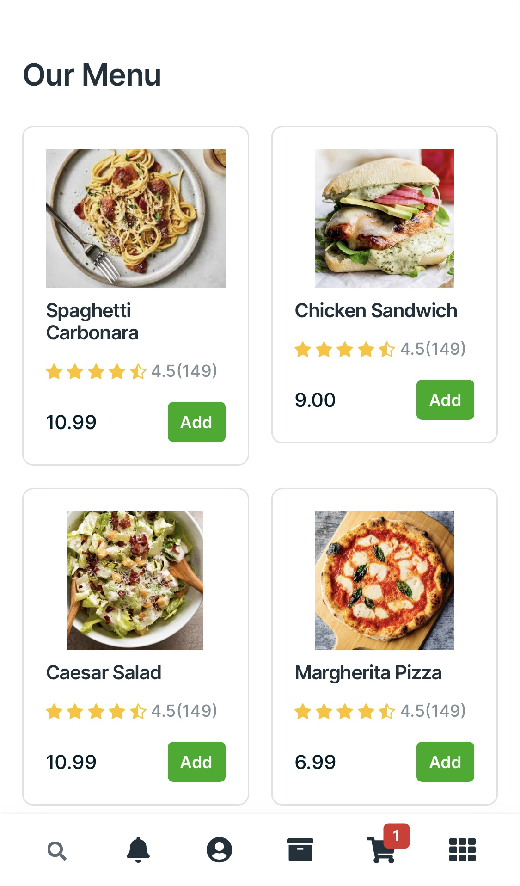

# Snap Menu



Snap Menu is a digital menu system that allows customers to access restaurant menus by scanning a QR code. The system is built using Django for the backend and Bootstrap for the frontend, providing a seamless and intuitive user experience.

## Table of Contents

- [Features](#features)
- [Prerequisites](#prerequisites)
- [Installation](#installation)
- [Running the Project](#running-the-project)

## Features

- QR code generation for accessing menus
- User authentication
- Menu browsing
- Shopping cart functionality
- Checkout process with order confirmation
- Admin dashboard for managing orders and menus

## Prerequisites

Before you begin, ensure you have met the following requirements:

- Python 3.8+
- Django 3.2+

## Installation

Follow these steps to get the project up and running on your local machine.

1. **Clone the repository:**
    ```sh
    git clone https://github.com/Mitchell-Travis/SnapMenu.git
    cd snap_menu
    ```

2. **Create a virtual environment:**
    ```sh
    python -m venv venv
    source venv/bin/activate  # On Windows use `venv\Scripts\activate`
    ```

3. **Install the dependencies:**
    ```sh
    pip install -r requirements.txt
    ```

4. **Apply migrations:**
    ```sh
    python manage.py migrate
    ```

5. **Create a superuser:**
    ```sh
    python manage.py createsuperuser
    ```

6. **Run the development server:**
    ```sh
    python manage.py runserver
    ```

7. **Open the application:**
    - Navigate to `http://127.0.0.1:8000` in your web browser.

## Running the Project

To start the project, use the following command:
```sh
python manage.py runserver


